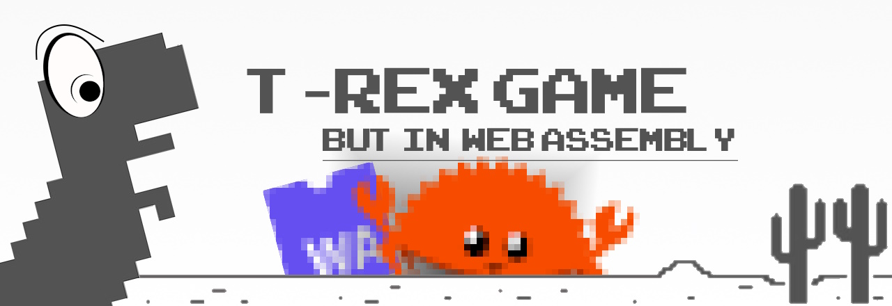

# 

## How to build
You need to install 
* Rustup + Cargo
* Wasm-pack (can be installed from Cargo)
* NodeJS (I'm using 20.14.0)
* npm (I'm using 10.7.0)
* Maybe some other stuff I forgot ^^'

To build using wasm-pack: 
`wasm-pack build`

Then, go to */demo*: `npm ci`

For dev mode: `npm run serve`

For production: `npm run build`

## Dependencies
* wasm-pack (including web-sys `0.3.70`)
* webpack

## Special thanks
| I asked some help to understand Rust:        |
|----------------------------------------------|
| [@Reachip](https://github.com/Reachip)       |
| [@i5.650](https://github.com/i5-650)         |
| [@PowerPixel](https://github.com/PowerPixel) |
